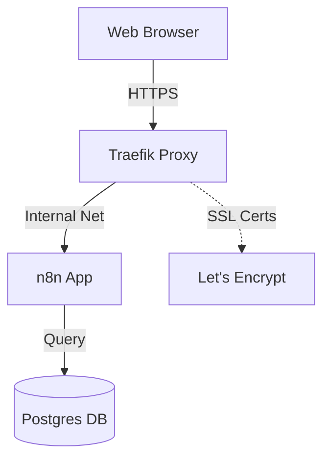

# Professional n8n Deployment Template ⚡

[](https://n8n.io)
[](https://www.docker.com/)
[](https://www.postgresql.org/)
[](https://traefik.io/)

A production-ready, expert-level `docker-compose` setup for **n8n**. This template handles everything from local development to production-grade deployment with automatic SSL, a dedicated Postgres database, and secure networking.

---

## ✨ Features

- 🛠 **Dual Setup**: Switch between Local Dev and Production in seconds.
- 🔒 **Auto-SSL**: Built-in Traefik reverse proxy with Let's Encrypt integration.
- 🐘 **Enterprise Database**: Uses PostgreSQL (16) instead of SQLite for maximum stability.
- 🛡 **Security First**: Environment-variable driven configuration with secure internal networking.
- 🚀 **One-Click Fix**: Includes a recovery script for local volume/key conflicts.

---

## 🏗 Architecture



---

## 💻 Quick Start (Local Development)

Run n8n on your laptop without needing a domain or SSL.

1.  **Clone & Prepare**:
    ```bash
    cp .env.example .env
    ```
2.  **Launch**:
    ```bash
    docker compose -f docker-compose.local.yml up -d
    ```
3.  **Access**: Open [http://localhost:5679](http://localhost:5679)

> [!TIP]
> If you encounter "Connection Refused", simply run `.\fix_local.ps1` in PowerShell.

---

## 🌐 Production Deployment

Best for VPS providers like **Oracle Cloud (Always Free)**, **Hetzner**, or **DigitalOcean**.

### 1. Prerequisites
- A domain name (e.g., `n8n.yourdomain.com`) pointed to your VPS IP.
- Docker & Docker Compose installed.

### 2. Configuration
Edit your `.env` file:
```bash
DOMAIN_NAME=n8n.yourdoman.com
SSL_EMAIL=your@email.com
N8N_ENCRYPTION_KEY=generate_a_random_string
POSTGRES_PASSWORD=secure_password
```

### 3. Launch
```bash
docker compose up -d
```
Traefik will automatically provision an SSL certificate. Wait ~1-2 minutes and visit `https://n8n.yourdomain.com`.

---

## 🔧 Project Structure

- `docker-compose.yml`: Production stack (Traefik + n8n + Postgres).
- `docker-compose.local.yml`: Local stack (Direct port access).
- `.env.example`: Template for configuration.
- `fix_local.ps1`: Automated cleanup script.

---

## 📜 License
MIT License. Feel free to use this for your personal or commercial projects.
